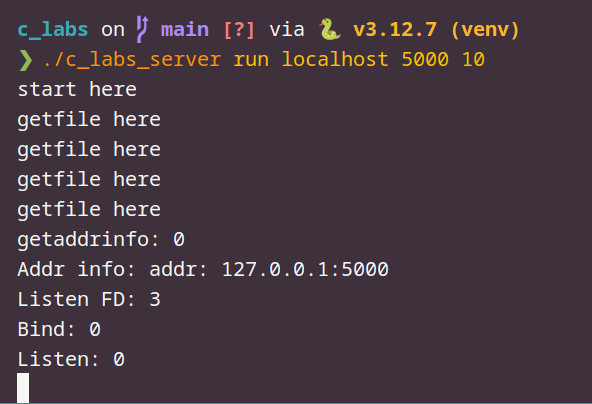
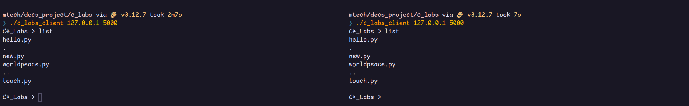
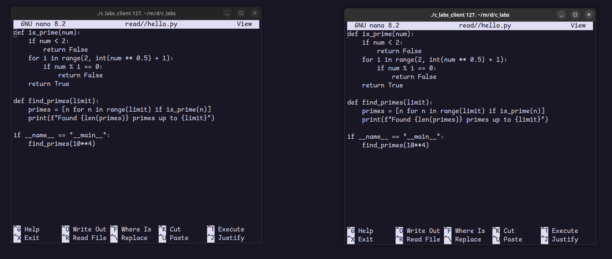
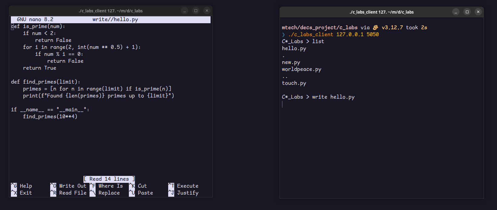
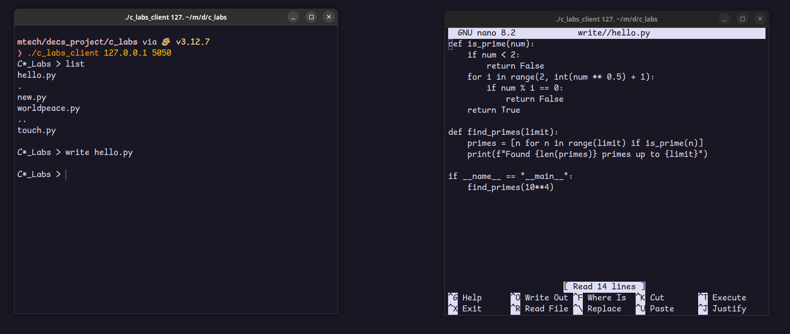
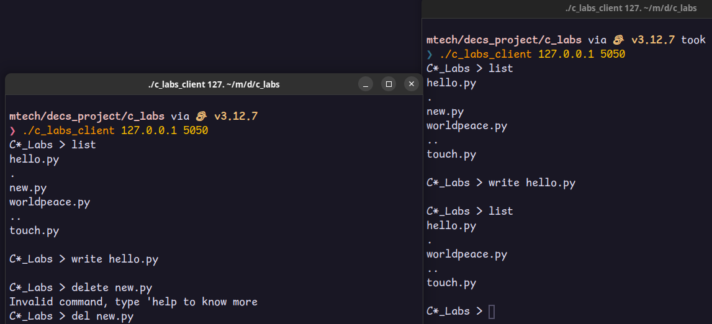
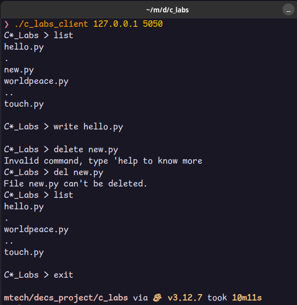

# C* Labs
- ## Build
    ```bash
    make
    ```
- ## Usage
    - **Server**
    ```bash
    ./c_labs_server <run/help> <ip> <port> <thread_count>
    ```
    - **Client**
    ```bash
    ./c_labs_client <ip> <port>
    ```
- ## Output
    - **Starting server**
        - 
    - **list command**
        - 
    - **reading a file**
        - 
    - **Performing 2 writes concurrently but latter one blocks**
        - 
    - **Current writing client exits writing, now the blocked writer can perform write**
        - 
    - **deleting file**
        - 
    - **exit**
        - 
